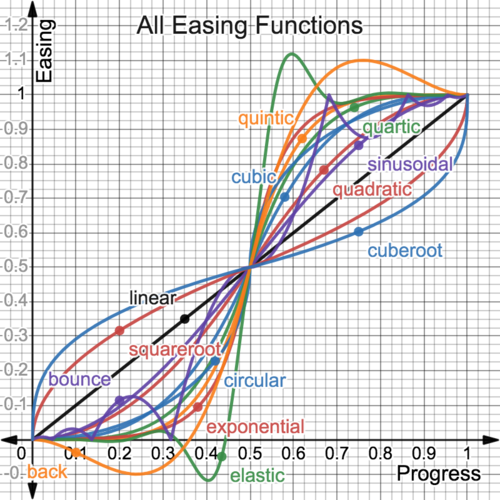
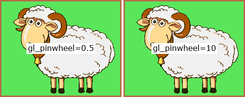
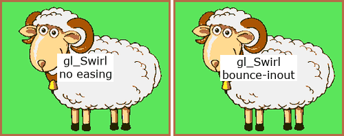
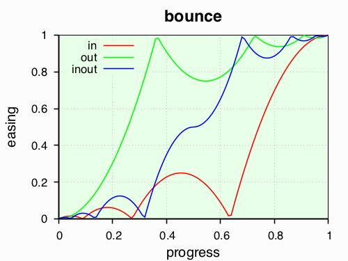
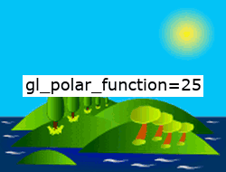

# FFmpeg Xfade custom easing and transition expressions

## Summary

Xfade is a FFmpeg video transition filter which provides an expression evaluator for custom effects.
Xfade transition progress is linear, which starts and stops abruptly and appears disjointed.
Easing inserts a transition progress envelope to smooth the effect.

This is a port of standard easing equations coded as custom xfade expressions.
It also ports most xfade transitions, some [GL Transitions](https://github.com/gl-transitions/gl-transitions) and other transitions for use in tandem with the easing expressions or alone.

Deployment involves setting the xfade `transition` parameter to `custom` and the `expr` parameter to the concaternation of an easing expression and a transition expression.
Pre-generated [expressions](expr) can be copied verbatim but an [expression generator](#expression-generator-cli-script) is also provided.

*Example*: wipedown with cubic easing:


```bash
ffmpeg -i first.mp4 -i second.mp4 -filter_complex_threads 1 -filter_complex "
    xfade=duration=3:offset=1:transition=custom:expr='
        st(0,1-P); st(1,if(gt(P,0.5),4*ld(0)^3,1-4*P^3)); st(0,1-ld(1)) ;
        if(gt(Y,H*(1-ld(0))),A,B)
    '" output.mp4
```
Here, the `expr` parameter is shown on two lines for clarity.
The first line is the easing expression $e(P)$ (cubic in-out) which stores its calculated progress value in `st(0)`.
The second line is the  transition expression $t(e(P))$ (wipedown) which loads its eased progress value from `ld(0)` instead of $P$.
The semicolon token combines expressions.

> [!NOTE]
> the example appears overly complicated because xfade progress `P` moves from 1 to 0 but the easing equations expect progress from 0 to 1

> [!IMPORTANT]
> ffmpeg option `-filter_complex_threads 1` is required because xfade expressions are not thread-safe (the `st()` & `ld()` functions use xfade context memory), consequently processing is slower

## Expressions

Pre-generated easing and transition expressions are in the [expr/](expr) subdirectory for mix and match use.
The [expression generator](#expression-generator-cli-script) can produce combined expressions in any syntax using expansion specifiers (like `printf`).

### Pixel format

Transitions that affect colour components work differently for RGB-type formats than non-RGB colour spaces and for different bit depths.
The expression generator emulates [vf_xfade.c](https://github.com/FFmpeg/FFmpeg/blob/master/libavfilter/vf_xfade.c) function `config_output()` logic, deducing the RGB signal type (`AV_PIX_FMT_FLAG_RGB`) from the format name (rgb/bgr/etc. see [pixdesc.c](https://github.com/FFmpeg/FFmpeg/blob/master/libavutil/pixdesc.c)) and the bit depth from `ffmpeg -pix_fmts` data.
It can then set the black, white and mid plane values correctly.
See [How does FFmpeg identify colorspaces?](https://trac.ffmpeg.org/wiki/colorspace#HowdoesFFmpegidentifycolorspaces) for details.

### Compact, for -filter_complex

This format is crammed into a single line stripped of whitespace.

*Example*: elastic out easing (leaves progress in `st(0)`)
```
st(0,1-P);st(1,1-cos(20*ld(0)*PI/3)/2^(10*ld(0)));st(0,1-ld(1))
```

### Verbose, for -filter_complex_script

This format is best for expressions that are too unwieldy for inline ffmpeg commands.

*Example*: gl_WaterDrop transition (expects progress in `ld(0)`)
```
st(1, 30);
st(2, 30);
st(3, X / W - 0.5);
st(4, 0.5 - Y / H);
st(5, hypot(ld(3), ld(4)));
st(6, A);
if(lte(ld(5), 1 - ld(0)),
 st(1, sin(ld(5) * ld(1) - (1 - ld(0)) * ld(2)));
 st(3, ld(3) * ld(1));
 st(4, ld(4) * ld(1));
 st(3, X + ld(3) * W);
 st(4, Y - ld(4) * H);
 st(6, if(eq(PLANE,0), a0(ld(3),ld(4)), if(eq(PLANE,1), a1(ld(3),ld(4)), if(eq(PLANE,2), a2(ld(3),ld(4)), a3(ld(3),ld(4))))))
);
ld(6) * ld(0) + B * (1 - ld(0))
```

## Easing expressions

### Standard easings (Robert Penner)

This implementation uses [Michael Pohoreski’s](https://github.com/Michaelangel007/easing#tldr-shut-up-and-show-me-the-code) single argument version of [Robert Penner’s](http://robertpenner.com/easing/) easing functions, further optimised by me.

- linear  
- quadratic  
- cubic  
- quartic  
- quintic  
- sinusoidal  
- exponential  
- circular  
- elastic  
- back  
- bounce



Here are all the standard easings superimposed by the [Desmos Graphing Calculator](https://www.desmos.com/calculator):


### Other easings

- squareroot  
- cuberoot

The `squareroot` & `cuberoot` easings focus more on the middle regions and less on the extremes, opposite to `quadratic` & `cubic` respectively:


## Transition expressions

### Xfade transitions

These are ports of the C-code transitions in [vf_xfade.c](https://github.com/FFmpeg/FFmpeg/blob/master/libavfilter/vf_xfade.c) for use with easing.
Omitted transitions are `distance`, `hblur`, `fadegrays` which perform aggregation, so cannot be computed efficiently on a per plane-pixel basis.

- fade fadefast fadeslow fadeblack fadewhite  
- wipeleft wiperight wipeup wipedown  
- wipetl wipetr wipebl wipebr  
- slideleft slideright slideup slidedown  
- smoothleft smoothright smoothup smoothdown  
- circlecrop rectcrop  
- circleopen circleclose  
- vertopen vertclose horzopen horzclose  
- dissolve pixelize  
- diagtl diagtr diagbl diagbr  
- hlslice hrslice vuslice vdslice  
- radial zoomin  
- squeezeh squeezev  
- hlwind hrwind vuwind vdwind  
- coverleft coverright  
- coverup coverdown  
- revealleft revealright  
- revealup revealdown

#### Gallery

See the FFmpeg Wiki [Xfade page](https://trac.ffmpeg.org/wiki/Xfade#Gallery).

### GL Transitions

Below are xfade ports of some of the simpler GLSL transitions at [GL Transitions](https://github.com/gl-transitions/gl-transitions) for use with or without easing.

- gl_angular [args: startingAngle; default: =90]
- gl_CrazyParametricFun [args: a,b,amplitude,smoothness; default: =4,1,120,0.1]
- gl_crosswarp
- gl_directionalwarp [args: smoothness,direction.x,direction.y; default: =0.1,-1,1]
- gl_kaleidoscope [args: speed,angle,power; default: =1,1,1.5]
- gl_multiply_blend
- gl_pinwheel [args: speed; default: =2]
- gl_polar_function [args: segments; default: =5]
- gl_PolkaDotsCurtain [args: dots,centre.x,centre.y; default: =20,0,0]
- gl_randomsquares [args: size.x,size.y,smoothness; default: =10,10,0.5]
- gl_ripple [args: amplitude,speed; default: =100,50]
- gl_rotate_scale_fade [args: centre.x,centre.y,rotations,scale,backColor(0=black;!0=white); default: =0.5,0.5,1,8,0]
- gl_squareswire [args: squares.h,squares.v,direction.x,direction.y,smoothness; default: =10,10,1.0,-0.5,1.6]
- gl_Swirl
- gl_WaterDrop [args: amplitude,speed; default: =30,30]

> [!NOTE]
> there are faster and better ways to use the complete set of GL Transitions with FFmpeg:  
> [ffmpeg-gl-transition](https://github.com/transitive-bullshit/ffmpeg-gl-transition) is a native FFmpeg filter which requires building ffmpeg from source  
> [ffmpeg-concat](https://github.com/transitive-bullshit/ffmpeg-concat) is a Node.js package which may require installation  
> [xfade_opencl](https://ffmpeg.org/ffmpeg-filters.html#xfade_005fopencl) FFmpeg filter can run custom transition effects from OpenCL source (not OpenGL) but enablement is quite involved

#### Parameters

Many GL Transitions accept parameters which can be set to tweak the transition.
The parameters and default values are shown above.

Using [xfade-easing.sh](#expression-generator-cli-script), parameters can be appended to the transition name as CSV.

*Example*: two pinwheel speeds: `-t gl_pinwheel=0.5` and `-t gl_pinwheel=10`



Alternatively just hack the [expressions](expr) directly.
The parameters are specified first, using store functions `st(p,v)`
where `p` is the parameter number and `v` its value.
So for `gl_pinwheel` and a `speed` value of 10, change the first line of its expr below to `st(1, 10);`.
```
st(1, 2);
st(1, atan2(0.5 - Y / H, X / W - 0.5) + (1 - P) * ld(1));
st(1, mod(ld(1), PI / 4));
st(1, sgn(1 - P - ld(1)));
st(1, if(lt(0.5, ld(1)), 0, 1));
A * ld(1) + B * (1 - ld(1))
```
Similarly, `gl_directionalwarp` takes 3 parameters: `smoothness`, `direction.x`, `direction.y` (from `xfade-easing.sh -L`)
and its expr starts with 3 corresponding `st()` (store) functions which may be changed from their default values:
```
st(1, 0.1);
st(2, -1);
st(3, 1);
st(4, hypot(ld(2), ld(3)));
etc.
```

#### With easing

GL Transitions can also be eased, with or without parameters:

*Example*: Swirl: `-t gl_Swirl -e bounce`



#### Gallery

<!-- GL pics at https://github.com/gre/gl-transition-libs/tree/master/packages/website/src/images/raw -->

Here are the xfade-ported GL Transitions with default parameters and no easing.
See also the [GL Transitions Gallery](https://gl-transitions.com/gallery).


#### Porting notes

GLSL shader code runs on the GPU in real time. However GL Transition and Xfade contexts are similar and simple algorithms are easily ported for non-live application.

| context | GL Transitions | Xfade filter | notes |
| :---: | :---: | :---: | --- |
| progress | `uniform float progress` <br/> moves from 0 to 1 | `P` <br/> moves from 1 to 0 | `progress ≡ 1 - P` |
| ratio | `uniform float ratio` | `W / H` | GL width and height are normalised |
| coordinates | `vec2 uv` <br/> `uv.y == 0` is bottom <br/> `uv == vec2(1.0)` is top-right | `X`, `Y` <br/> `Y == 0` is top <br/> `(X,Y) == (W,H)` is bottom-right | `uv.x ≡ X / W` <br/> `uv.y ≡ 1 - Y / H` |
| texture | `vec4 getFromColor(vec2 uv)` <hr/> `vec4 getToColor(vec2 uv)` | `a0(x,y)` to `a3(x,y)` <br/> or `A` for first input <hr/> `b0(x,y)` to `b3(x,y)` <br/> or `B` for second input | xfade `expr` is evaluated for every component pixel |

### Other transitions

Transition `x_screen_blend` is the opposite of `gl_multiply_blend`; they lighten and darken the transition respectively.
Use `x_overlay_blend` to boost contrast by combining multiply and screen blends.

- x_screen_blend  
- x_overlay_blend

## Expression generator CLI script

[xfade-easing.sh](xfade-easing.sh) is a Bash 4 script that generates custom easing and transition expressions for the xfade `expr` parameter.
It can also generate easing graphs via gnuplot and demo videos for testing.

### Usage
```
FFmpeg Xfade Easing script (xfade-easing.sh version 1.1f) by Raymond Luckhurst, scriptit.uk
Generates custom xfade filter expressions for rendering transitions with easing.
See https://ffmpeg.org/ffmpeg-filters.html#xfade & https://trac.ffmpeg.org/wiki/Xfade
Usage: xfade-easing.sh [options]
Options:
    -f pixel format (default: rgb24): use ffmpeg -pix_fmts for list
    -t transition name (default: fade); use -L for list
    -e easing function (default: linear); see -L for list
    -m easing mode (default: inout): in out inout
    -x expr output filename (default: no expr), accepts expansions, - for stdout
    -a append to expr output file
    -s expr output format string (default: '%x')
       %t expands to the transition name; %e easing name; %m easing mode
       %T, %E, %M upper case expansions of above
       %a expands to the transition arguments; %A to the default arguments (if any)
       %x expands to the generated expr, compact, best for inline filterchains
       %X does too but is more legible, good for filter_complex_script files
       %y expands to the easing expression only, compact; %Y legible
       %z expands to the eased transition expression only, compact; %Z legible
          for the uneased transition expression only, use -e linear (default) and %x or %X
       %n inserts a newline
    -p easing plot output filename (default: no plot)
       accepts expansions but %m/%M are pointless as plots show all easing modes
       formats: gif, jpg, png, svg, pdf, eps, html <canvas>, determined from file extension
    -c canvas size for easing plot (default: 640x480, scaled to inches for PDF/EPS)
       format: WxH; omitting W or H keeps aspect ratio, e.g -z x300 scales W
    -v video output filename (default: no video), accepts expansions
       formats: animated gif, mp4 (x264 yuv420p), mkv (FFV1 lossless) from file extension
       if gifsicle is available then gifs will be optimised
    -i video inputs CSV (2 or more needed, default: sheep,goat - inline pngs 250x200)
    -z video size (default: input 1 size)
       format: WxH; omitting W or H keeps aspect ratio, e.g -z 300x scales H
    -l video length per transition (default: 5s)
       total length is this length times (number of inputs - 1)
    -d video transition duration (default: 3s)
    -r video framerate (default: 25fps)
    -n show effect name on video as text
    -u video text font size multiplier (default: 1.0)
    -2 video stack orientation,gap,colour (default: ,0,white), e.g. h,2,red
       stacks uneased and eased videos horizontally (h), vertically (v) or auto (a)
       auto (a) selects the orientation that displays easing to best effect
       also stacks transitions with default and custom parameters, eased or not
       videos are not stacked unless they are different (nonlinear or customised)
    -L list all transitions and easings
    -H show this usage text
    -V show the script version
    -T temporary file directory (default: /tmp)
    -K keep temporary files if temporary directory is not /tmp
Notes:
    1. point the shebang path to a bash4 location (defaults to MacPorts install)
    2. this script requires Bash 4 (2009), gawk, gsed, envsubst, ffmpeg, gnuplot, base64
    3. use -filter_complex_threads 1 ffmpeg option (slower!) because xfade expressions
       are not thread-safe (the st() & ld() functions use contextual allocation)
    4. certain xfade transitions are not implemented because they perform aggregation
       (distance, fadegrays, hblur)
    5. a few GL Transitions are also ported, some of which take parameters;
       to override the default parameters append as CSV after an = sign,
       e.g. -t gl_PolkaDotsCurtain=10,0.5,0.5 for 10 dots centred
       (see https://gl-transitions.com/gallery)
    6. many transitions do not lend themselves well to easing, and easings that overshoot
       (back & elastic) may cause weird effects!
```
### Generating expr code

- `xfade-easing.sh -t slideright -e quadratic -m out -x -`  
prints expr for slideright transition with quadratic-out easing to stdout
- `xfade-easing.sh -t coverup -e quartic -m in -x coverup-quartic_in.txt`  
prints expr for coverup transition with quartic-in easing to file coverup-quartic_in.txt
- `xfade-easing.sh -t coverup -e quartic -m in -x %t-%e_%m.txt`  
ditto, using expansion specifiers in file name
- `xfade-easing.sh -t rectcrop -e exponential -m inout -s "\$expr['%t_%e_%m'] = '%n%X';" -x exprs.php -a`  
appends the following to file exprs.php:
```php
$expr['rectcrop_exponential_inout'] = '
st(0, 1 - P);
st(1, if(gt(P, 0.5), if(eq(P, 1), 0, 2^(9 - 20 * P)), if(eq(P, 0), 1, 1 - 2^(20 * P - 11))));
st(0, 1 - ld(1))
;
st(1, abs(ld(0) - 0.5) * W);
st(2, abs(ld(0) - 0.5) * H);
st(3, lt(abs(X - W / 2), ld(1) * lt(abs(Y - H / 2), ld(2))));
st(4, if(lt(ld(0), 0.5), B, A));
if(not(ld(3)), if(lt(PLANE,3), 0, 255), ld(4))';
```
- `xfade-easing.sh -t gl_multiply_blend -s "expr='%n%X'" -x fc-script.txt -a`  
This is not eased, therefore the expr appended to fc-script.txt uses progress `P` directly:
```shell
expr='
st(1, A * B / 255);
st(2, 2 * (1 - P));
if(gt(P, 0.5), ld(1) * ld(2) + A * (1 - ld(2)), st(2, ld(2) - 1); B * ld(2) + ld(1) * (1 - ld(2)))'
```

### Generating test plots

Plot data is generated using the `print` function of the ffmpeg expression evaluator for the first plane and first pixel as xfade progress `P` goes from 1 to 0 at 100fps.
It is therefore real-time data.

The plots above in [Standard easings](#standard-easings-robert-penner) show the test plots for all easings and all 3 modes (in, out and in-out).

- `xfade-easing.sh -e elastic -p plot-%e.pdf`  
creates a PDF file plot-elastic.pdf of the elastic easing
- `xfade-easing.sh -e bounce -p %e.png -c 500x`  
creates image file bounce.png of the bounce easing scaled to 500px wide



### Generating demo videos

> [!NOTE] the images shown here are animated GIFs

- `xfade-easing.sh -t hlwind -e quartic -m in -v windy.gif`  
creates an animated GIF image of the hlwind transition with quartic-in easing  


- `xfade-easing.sh -t radial -e squareroot -m inout -v %t-%e.mp4 -n -u 1.5`  
creates a video annotated in larger text using expansion specifiers for the file name  


- `xfade-easing.sh -t gl_polar_function=25 -i islands.png,rainbow.png -v paradise.mkv`  
creates a lossless (FFV1) video (e.g. for further processing) of a GL transition with given parameters between specified inputs  


- `xfade-easing.sh -t gl_angular=0 -e exponential -i street.png,road.png,flowers.png,bird.png,barley.png -v multiple.mp4 -z 250x`
creates a video of the GL transition `angular` with parameter `startingAngle=0` (west) for 8 inputs  


- `xfade-easing.sh -t circlecrop -e quintic -i phone.png,beach.png -v home-away.mp4 -l 10 -d 8 -z 246x -2 h,8,white -n`  
creates a 10s video, horizontally stacked with 8px white gap, with a slow 8s transition demonstrating quintic easing  


- `xfade-easing.sh -t gl_PolkaDotsCurtain=10,0.5,0.5 -e quadratic -i balloons.png,fruits.png -v living-life.mp4 -l 7 -d 5 -z 500x -r 30 -f yuv420p`  
a 5 second GL transition with arguments and gentle quadratic easing, running at 30fps for 7 seconds, processing in YUV (Y'CbCr) colour space throughout  


## See also

- [FFmpeg Xfade filter](https://ffmpeg.org/ffmpeg-filters.html#xfade) reference documentation
- [FFmpeg Wiki Xfade page](https://trac.ffmpeg.org/wiki/Xfade) with gallery
- [FFmpeg Expression Evaluation](https://ffmpeg.org/ffmpeg-utils.html#Expression-Evaluation) reference documentation
- [Robert Penner’s Easing Functions](http://robertpenner.com/easing/) the original, from 2001
- [Michael Pohoreski’s Easing Functions](https://github.com/Michaelangel007/easing#tldr-shut-up-and-show-me-the-code) single oarameter versions of Penner’s Functions
- [GL Transitions homepage](https://gl-transitions.com) and [Gallery](https://gl-transitions.com/gallery) and [Editor](https://gl-transitions.com/editor)
- [GL Transitions repository](https://github.com/gl-transitions/gl-transitions) on GitHub
- [OpenGL Reference Pages](https://registry.khronos.org/OpenGL-Refpages/gl4/)
- [libavfilter/vf_xfade.c](https://github.com/FFmpeg/FFmpeg/blob/master/libavfilter/vf_xfade.c) xfade C code
- [libavutil/eval.c](https://github.com/FFmpeg/FFmpeg/blob/master/libavutil/eval.c) expr C code
- [ffmpeg-gl-transition](https://github.com/transitive-bullshit/ffmpeg-gl-transition) native FFmpeg GL Transitions filter
- [ffmpeg-concat](https://github.com/transitive-bullshit/ffmpeg-concat) Node.js package concats videos with GL Transitions
